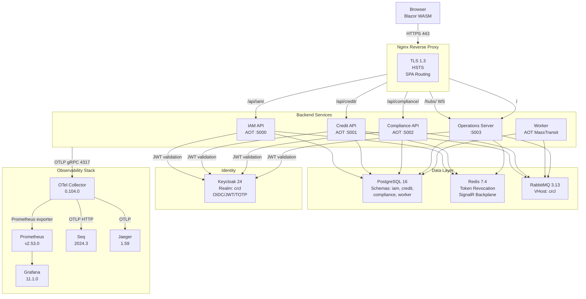

# SPEC-07 — DevOps & Infrastructure

**Project:** Credit Risk Compliance Lab  
**Module:** Docker, CI/CD, Observability, Database, Keycloak  
**Version:** 1.0.0  
**Status:** Draft  
**Dependencies:** SPEC-01 through SPEC-06

---

## 1. Overview

This document specifies the complete infrastructure configuration for the Credit Risk Compliance Lab. It covers:

- Multi-stage Dockerfiles for all 6 application services (AOT-compiled)
- `docker-compose.yml` with all 15 services
- `docker-compose.override.yml` for local development
- OpenTelemetry Collector configuration
- Prometheus scrape config and alerting rules
- Grafana dashboard provisioning
- Nginx reverse proxy (TLS 1.3, HSTS, SPA routing)
- PostgreSQL schema initialization, RLS, and audit log
- Keycloak realm export with clients, roles, and TOTP policy
- GitHub Actions CI/CD pipeline (build → test → publish → deploy)

### 1.1 Service Inventory

| Service | Image | Port | Description |
|---|---|---|---|
| `iam-api` | Custom AOT | 5000 | Identity & Access Management API |
| `credit-api` | Custom AOT | 5001 | Credit Analysis API |
| `compliance-api` | Custom AOT | 5002 | Compliance/AML API |
| `operations-server` | Custom | 5003 | Operations Server + Blazor WASM host |
| `bureau-mock` | Custom | 8081 | Credit Bureau Mock Service |
| `credit-worker` | Custom AOT | — | Credit Analysis background worker |
| `compliance-worker` | Custom AOT | — | Compliance background worker |
| `nginx` | nginx:1.27-alpine | 80/443 | Reverse proxy + TLS termination |
| `postgres` | postgres:16-alpine | 5432 | Primary database |
| `redis` | redis:7.4-alpine | 6379 | Token revocation + SignalR backplane |
| `rabbitmq` | rabbitmq:3.13-management | 5672/15672 | Message broker |
| `keycloak` | quay.io/keycloak/keycloak:24.0 | 8080 | Identity provider |
| `otel-collector` | otel/opentelemetry-collector-contrib:0.104.0 | 4317/4318 | Telemetry collector |
| `prometheus` | prom/prometheus:v2.53.0 | 9090 | Metrics storage |
| `grafana` | grafana/grafana:11.1.0 | 3000 | Dashboards |
| `seq` | datalust/seq:2024.3 | 5341 | Structured log viewer |
| `jaeger` | jaegertracing/all-in-one:1.59 | 16686 | Distributed tracing UI |

---

## 2. Dockerfiles

### 2.1 IAM API — AOT Dockerfile

```dockerfile
# File: src/modules/iam/CreditRisk.IAM.Api/Dockerfile
FROM mcr.microsoft.com/dotnet/sdk:8.0 AS build
WORKDIR /src

# Install AOT prerequisites
RUN apt-get update && apt-get install -y clang zlib1g-dev && rm -rf /var/lib/apt/lists/*

# Copy solution and restore
COPY Directory.Build.props Directory.Packages.props global.json ./
COPY src/shared/ src/shared/
COPY src/modules/iam/ src/modules/iam/

WORKDIR /src/src/modules/iam/CreditRisk.IAM.Api
RUN dotnet restore --runtime linux-x64

# Publish with Native AOT
RUN dotnet publish \
    --configuration Release \
    --runtime linux-x64 \
    --self-contained true \
    -p:PublishAot=true \
    -p:StripSymbols=true \
    --output /app/publish

# ── Runtime stage ──────────────────────────────────────────────────────────
FROM mcr.microsoft.com/dotnet/runtime-deps:8.0-noble-chiseled AS runtime
WORKDIR /app

# Non-root user (chiseled image already uses app:app)
COPY --from=build /app/publish .

EXPOSE 8080
ENTRYPOINT ["./CreditRisk.IAM.Api"]
```

### 2.2 Credit Analysis API — AOT Dockerfile

```dockerfile
# File: src/modules/credit-analysis/CreditRisk.CreditAnalysis.Api/Dockerfile
FROM mcr.microsoft.com/dotnet/sdk:8.0 AS build
WORKDIR /src

RUN apt-get update && apt-get install -y clang zlib1g-dev && rm -rf /var/lib/apt/lists/*

COPY Directory.Build.props Directory.Packages.props global.json ./
COPY src/shared/ src/shared/
COPY src/modules/credit-analysis/ src/modules/credit-analysis/

WORKDIR /src/src/modules/credit-analysis/CreditRisk.CreditAnalysis.Api
RUN dotnet restore --runtime linux-x64
RUN dotnet publish \
    --configuration Release \
    --runtime linux-x64 \
    --self-contained true \
    -p:PublishAot=true \
    -p:StripSymbols=true \
    --output /app/publish

FROM mcr.microsoft.com/dotnet/runtime-deps:8.0-noble-chiseled AS runtime
WORKDIR /app
COPY --from=build /app/publish .
EXPOSE 8080
ENTRYPOINT ["./CreditRisk.CreditAnalysis.Api"]
```

### 2.3 Compliance API — AOT Dockerfile

```dockerfile
# File: src/modules/compliance/CreditRisk.Compliance.Api/Dockerfile
FROM mcr.microsoft.com/dotnet/sdk:8.0 AS build
WORKDIR /src

RUN apt-get update && apt-get install -y clang zlib1g-dev && rm -rf /var/lib/apt/lists/*

COPY Directory.Build.props Directory.Packages.props global.json ./
COPY src/shared/ src/shared/
COPY src/modules/compliance/ src/modules/compliance/

WORKDIR /src/src/modules/compliance/CreditRisk.Compliance.Api
RUN dotnet restore --runtime linux-x64
RUN dotnet publish \
    --configuration Release \
    --runtime linux-x64 \
    --self-contained true \
    -p:PublishAot=true \
    -p:StripSymbols=true \
    --output /app/publish

FROM mcr.microsoft.com/dotnet/runtime-deps:8.0-noble-chiseled AS runtime
WORKDIR /app
COPY --from=build /app/publish .
EXPOSE 8080
ENTRYPOINT ["./CreditRisk.Compliance.Api"]
```

### 2.4 Worker — AOT Dockerfile

```dockerfile
# File: src/workers/CreditRisk.CreditAnalysis.Worker/Dockerfile
FROM mcr.microsoft.com/dotnet/sdk:8.0 AS build
WORKDIR /src

RUN apt-get update && apt-get install -y clang zlib1g-dev && rm -rf /var/lib/apt/lists/*

COPY Directory.Build.props Directory.Packages.props global.json ./
COPY src/shared/ src/shared/
COPY src/modules/credit-analysis/ src/modules/credit-analysis/
COPY src/workers/CreditRisk.CreditAnalysis.Worker/ src/workers/CreditRisk.CreditAnalysis.Worker/

WORKDIR /src/src/workers/CreditRisk.CreditAnalysis.Worker
RUN dotnet restore --runtime linux-x64
RUN dotnet publish \
    --configuration Release \
    --runtime linux-x64 \
    --self-contained true \
    -p:PublishAot=true \
    -p:StripSymbols=true \
    --output /app/publish

FROM mcr.microsoft.com/dotnet/runtime-deps:8.0-noble-chiseled AS runtime
WORKDIR /app
COPY --from=build /app/publish .
ENTRYPOINT ["./CreditRisk.CreditAnalysis.Worker"]
```

### 2.5 Operations Server — Standard Dockerfile (SignalR + Blazor WASM)

```dockerfile
# File: src/modules/operations/CreditRisk.Operations.Server/Dockerfile
# Note: NOT AOT — SignalR hub requires reflection for dynamic hub dispatch
FROM mcr.microsoft.com/dotnet/sdk:8.0 AS build
WORKDIR /src

COPY Directory.Build.props Directory.Packages.props global.json ./
COPY src/shared/ src/shared/
COPY src/modules/operations/ src/modules/operations/

WORKDIR /src/src/modules/operations/CreditRisk.Operations.Server
RUN dotnet restore
RUN dotnet publish \
    --configuration Release \
    --output /app/publish

FROM mcr.microsoft.com/dotnet/aspnet:8.0-noble-chiseled AS runtime
WORKDIR /app
COPY --from=build /app/publish .
EXPOSE 8080
ENTRYPOINT ["dotnet", "CreditRisk.Operations.Server.dll"]
```

---

## 3. `docker-compose.yml`

```yaml
# File: docker-compose.yml
name: credit-risk-compliance-lab

services:

  # ── Infrastructure ──────────────────────────────────────────────────────

  postgres:
    image: postgres:16-alpine
    container_name: crcl-postgres
    restart: unless-stopped
    environment:
      POSTGRES_DB: creditrisk
      POSTGRES_USER: ${POSTGRES_USER:-crcl}
      POSTGRES_PASSWORD: ${POSTGRES_PASSWORD:?POSTGRES_PASSWORD is required}
    volumes:
      - postgres_data:/var/lib/postgresql/data
      - ./infra/db/init-db.sql:/docker-entrypoint-initdb.d/01-init.sql:ro
      - ./infra/db/seed-data.sql:/docker-entrypoint-initdb.d/02-seed.sql:ro
    ports:
      - "5432:5432"
    healthcheck:
      test: ["CMD-SHELL", "pg_isready -U ${POSTGRES_USER:-crcl} -d creditrisk"]
      interval: 10s
      timeout: 5s
      retries: 5
    networks:
      - backend

  redis:
    image: redis:7.4-alpine
    container_name: crcl-redis
    restart: unless-stopped
    command: redis-server --requirepass ${REDIS_PASSWORD:?REDIS_PASSWORD is required} --appendonly yes
    volumes:
      - redis_data:/data
    ports:
      - "6379:6379"
    healthcheck:
      test: ["CMD", "redis-cli", "-a", "${REDIS_PASSWORD}", "ping"]
      interval: 10s
      timeout: 3s
      retries: 5
    networks:
      - backend

  rabbitmq:
    image: rabbitmq:3.13-management-alpine
    container_name: crcl-rabbitmq
    restart: unless-stopped
    environment:
      RABBITMQ_DEFAULT_USER: ${RABBITMQ_USER:-crcl}
      RABBITMQ_DEFAULT_PASS: ${RABBITMQ_PASSWORD:?RABBITMQ_PASSWORD is required}
      RABBITMQ_DEFAULT_VHOST: crcl
    volumes:
      - rabbitmq_data:/var/lib/rabbitmq
    ports:
      - "5672:5672"
      - "15672:15672"
    healthcheck:
      test: ["CMD", "rabbitmq-diagnostics", "ping"]
      interval: 15s
      timeout: 10s
      retries: 5
    networks:
      - backend

  keycloak:
    image: quay.io/keycloak/keycloak:24.0
    container_name: crcl-keycloak
    restart: unless-stopped
    command: start-dev --import-realm
    environment:
      KC_DB: postgres
      KC_DB_URL: jdbc:postgresql://postgres:5432/creditrisk
      KC_DB_USERNAME: ${POSTGRES_USER:-crcl}
      KC_DB_PASSWORD: ${POSTGRES_PASSWORD}
      KC_DB_SCHEMA: keycloak
      KEYCLOAK_ADMIN: ${KEYCLOAK_ADMIN:-admin}
      KEYCLOAK_ADMIN_PASSWORD: ${KEYCLOAK_ADMIN_PASSWORD:?KEYCLOAK_ADMIN_PASSWORD is required}
      KC_HOSTNAME_STRICT: "false"
      KC_HTTP_ENABLED: "true"
    volumes:
      - ./infra/keycloak/realm-export.json:/opt/keycloak/data/import/realm-export.json:ro
    ports:
      - "8080:8080"
    depends_on:
      postgres:
        condition: service_healthy
    healthcheck:
      # ⚠️ curl is NOT available in the Keycloak image — use bash TCP check instead.
      test: ["CMD-SHELL", "exec 3<>/dev/tcp/localhost/8080 && echo -e 'GET /health/ready HTTP/1.1\\r\\nHost: localhost\\r\\n\\r\\n' >&3 && cat <&3 | grep -q '200 OK'"]
      interval: 30s
      timeout: 10s
      retries: 20          # First-run DB migration can take up to 3 minutes
      start_period: 180s   # Allow 3 minutes before first health probe
    networks:
      - backend
      - frontend

  # ── Application Services ────────────────────────────────────────────────

  iam-api:
    build:
      context: .
      dockerfile: src/modules/iam/CreditRisk.IAM.Api/Dockerfile
    container_name: crcl-iam-api
    restart: unless-stopped
    environment:
      ASPNETCORE_ENVIRONMENT: Production
      ConnectionStrings__Default: Host=postgres;Database=creditrisk;Username=${POSTGRES_USER:-crcl};Password=${POSTGRES_PASSWORD};Search Path=iam
      Redis__ConnectionString: redis:6379,password=${REDIS_PASSWORD}
      Keycloak__Authority: http://keycloak:8080/realms/crcl
      Keycloak__ClientId: crcl-iam-api
      Keycloak__ClientSecret: ${KEYCLOAK_IAM_SECRET:?KEYCLOAK_IAM_SECRET is required}
      RabbitMQ__Host: rabbitmq
      RabbitMQ__VirtualHost: crcl
      RabbitMQ__Username: ${RABBITMQ_USER:-crcl}
      RabbitMQ__Password: ${RABBITMQ_PASSWORD}
      OTEL_EXPORTER_OTLP_ENDPOINT: http://otel-collector:4317
      OTEL_SERVICE_NAME: iam-api
    depends_on:
      postgres:
        condition: service_healthy
      redis:
        condition: service_healthy
      keycloak:
        condition: service_healthy
    networks:
      - backend

  credit-api:
    build:
      context: .
      dockerfile: src/modules/credit/CreditRisk.CreditAnalysis.Api/Dockerfile
    container_name: crcl-credit-api
    restart: unless-stopped
    environment:
      ASPNETCORE_ENVIRONMENT: Production
      ConnectionStrings__Default: Host=postgres;Database=creditrisk;Username=${POSTGRES_USER:-crcl};Password=${POSTGRES_PASSWORD};Search Path=credit
      Redis__ConnectionString: redis:6379,password=${REDIS_PASSWORD}
      Keycloak__Authority: http://keycloak:8080/realms/crcl
      RabbitMQ__Host: rabbitmq
      RabbitMQ__VirtualHost: crcl
      RabbitMQ__Username: ${RABBITMQ_USER:-crcl}
      RabbitMQ__Password: ${RABBITMQ_PASSWORD}
      BureauClient__BaseUrl: ${BUREAU_BASE_URL:?BUREAU_BASE_URL is required}
      BureauClient__ApiKey: ${BUREAU_API_KEY:?BUREAU_API_KEY is required}
      OTEL_EXPORTER_OTLP_ENDPOINT: http://otel-collector:4317
      OTEL_SERVICE_NAME: credit-api
    depends_on:
      postgres:
        condition: service_healthy
      redis:
        condition: service_healthy
      rabbitmq:
        condition: service_healthy
    networks:
      - backend

  compliance-api:
    build:
      context: .
      dockerfile: src/modules/compliance/CreditRisk.Compliance.Api/Dockerfile
    container_name: crcl-compliance-api
    restart: unless-stopped
    environment:
      ASPNETCORE_ENVIRONMENT: Production
      ConnectionStrings__Default: Host=postgres;Database=creditrisk;Username=${POSTGRES_USER:-crcl};Password=${POSTGRES_PASSWORD};Search Path=compliance
      Redis__ConnectionString: redis:6379,password=${REDIS_PASSWORD}
      Keycloak__Authority: http://keycloak:8080/realms/crcl
      RabbitMQ__Host: rabbitmq
      RabbitMQ__VirtualHost: crcl
      RabbitMQ__Username: ${RABBITMQ_USER:-crcl}
      RabbitMQ__Password: ${RABBITMQ_PASSWORD}
      OTEL_EXPORTER_OTLP_ENDPOINT: http://otel-collector:4317
      OTEL_SERVICE_NAME: compliance-api
    depends_on:
      postgres:
        condition: service_healthy
      rabbitmq:
        condition: service_healthy
    networks:
      - backend

  worker:
    build:
      context: .
      dockerfile: src/modules/worker/CreditRisk.Worker/Dockerfile
    container_name: crcl-worker
    restart: unless-stopped
    environment:
      DOTNET_ENVIRONMENT: Production
      ConnectionStrings__Default: Host=postgres;Database=creditrisk;Username=${POSTGRES_USER:-crcl};Password=${POSTGRES_PASSWORD};Search Path=worker
      RabbitMQ__Host: rabbitmq
      RabbitMQ__VirtualHost: crcl
      RabbitMQ__Username: ${RABBITMQ_USER:-crcl}
      RabbitMQ__Password: ${RABBITMQ_PASSWORD}
      BureauClient__BaseUrl: ${BUREAU_BASE_URL}
      BureauClient__ApiKey: ${BUREAU_API_KEY}
      OTEL_EXPORTER_OTLP_ENDPOINT: http://otel-collector:4317
      OTEL_SERVICE_NAME: worker
    depends_on:
      postgres:
        condition: service_healthy
      rabbitmq:
        condition: service_healthy
    networks:
      - backend

  operations-server:
    build:
      context: .
      dockerfile: src/modules/operations/CreditRisk.Operations.Server/Dockerfile
    container_name: crcl-operations-server
    restart: unless-stopped
    environment:
      ASPNETCORE_ENVIRONMENT: Production
      Keycloak__Authority: http://keycloak:8080/realms/crcl
      RabbitMQ__Host: rabbitmq
      RabbitMQ__VirtualHost: crcl
      RabbitMQ__Username: ${RABBITMQ_USER:-crcl}
      RabbitMQ__Password: ${RABBITMQ_PASSWORD}
      SignalR__BackplaneRedis: redis:6379,password=${REDIS_PASSWORD}
      OTEL_EXPORTER_OTLP_ENDPOINT: http://otel-collector:4317
      OTEL_SERVICE_NAME: operations-server
    depends_on:
      redis:
        condition: service_healthy
      rabbitmq:
        condition: service_healthy
      keycloak:
        condition: service_healthy
    networks:
      - backend
      - frontend

  # ── Reverse Proxy ───────────────────────────────────────────────────────

  nginx:
    image: nginx:1.27-alpine
    container_name: crcl-nginx
    restart: unless-stopped
    ports:
      - "80:80"
      - "443:443"
    volumes:
      - ./infra/nginx/nginx.conf:/etc/nginx/nginx.conf:ro
      - ./infra/nginx/certs:/etc/nginx/certs:ro
    depends_on:
      - iam-api
      - credit-api
      - compliance-api
      - operations-server
    networks:
      - frontend
      - backend

  # ── Observability ───────────────────────────────────────────────────────

  otel-collector:
    image: otel/opentelemetry-collector-contrib:0.104.0
    container_name: crcl-otel-collector
    restart: unless-stopped
    command: ["--config=/etc/otelcol/config.yml"]
    volumes:
      - ./infra/otel/otelcol-config.yml:/etc/otelcol/config.yml:ro
    ports:
      - "4317:4317"   # OTLP gRPC
      - "4318:4318"   # OTLP HTTP
      - "8888:8888"   # Collector metrics
    depends_on:
      - prometheus
      - jaeger
      - seq
    networks:
      - backend
      - observability

  prometheus:
    image: prom/prometheus:v2.53.0
    container_name: crcl-prometheus
    restart: unless-stopped
    command:
      - "--config.file=/etc/prometheus/prometheus.yml"
      - "--storage.tsdb.path=/prometheus"
      - "--storage.tsdb.retention.time=30d"
      - "--web.enable-lifecycle"
    volumes:
      - ./infra/prometheus/prometheus.yml:/etc/prometheus/prometheus.yml:ro
      - ./infra/prometheus/alerts.yml:/etc/prometheus/alerts.yml:ro
      - prometheus_data:/prometheus
    ports:
      - "9090:9090"
    networks:
      - observability

  grafana:
    image: grafana/grafana:11.1.0
    container_name: crcl-grafana
    restart: unless-stopped
    environment:
      GF_SECURITY_ADMIN_USER: ${GRAFANA_ADMIN_USER:-admin}
      GF_SECURITY_ADMIN_PASSWORD: ${GRAFANA_ADMIN_PASSWORD:?GRAFANA_ADMIN_PASSWORD is required}
      GF_USERS_ALLOW_SIGN_UP: "false"
      GF_SERVER_ROOT_URL: https://localhost/grafana
      GF_SERVER_SERVE_FROM_SUB_PATH: "true"
    volumes:
      - ./infra/grafana/provisioning:/etc/grafana/provisioning:ro
      - grafana_data:/var/lib/grafana
    ports:
      - "3000:3000"
    depends_on:
      - prometheus
    networks:
      - observability

  seq:
    image: datalust/seq:2024.3
    container_name: crcl-seq
    restart: unless-stopped
    environment:
      ACCEPT_EULA: "Y"
      SEQ_FIRSTRUN_ADMINPASSWORDHASH: ${SEQ_ADMIN_PASSWORD_HASH:?SEQ_ADMIN_PASSWORD_HASH is required}
    volumes:
      - seq_data:/data
    ports:
      - "5341:5341"   # Ingestion
      - "8081:80"     # UI
    networks:
      - observability

  jaeger:
    image: jaegertracing/all-in-one:1.59
    container_name: crcl-jaeger
    restart: unless-stopped
    environment:
      COLLECTOR_OTLP_ENABLED: "true"
    ports:
      - "16686:16686"  # UI
      - "14317:4317"   # OTLP gRPC (internal)
    networks:
      - observability

volumes:
  postgres_data:
  redis_data:
  rabbitmq_data:
  prometheus_data:
  grafana_data:
  seq_data:

networks:
  backend:
    driver: bridge
  frontend:
    driver: bridge
  observability:
    driver: bridge
```

---

## 4. `docker-compose.override.yml` (Local Development)

```yaml
# File: docker-compose.override.yml
# Overrides for local development: exposes internal ports, mounts source for hot reload
services:

  iam-api:
    build:
      target: build
    environment:
      ASPNETCORE_ENVIRONMENT: Development
      ASPNETCORE_URLS: http://+:8080
    ports:
      - "5000:8080"
    volumes:
      - ./src/modules/iam:/src/src/modules/iam

  credit-api:
    environment:
      ASPNETCORE_ENVIRONMENT: Development
    ports:
      - "5001:8080"

  compliance-api:
    environment:
      ASPNETCORE_ENVIRONMENT: Development
    ports:
      - "5002:8080"

  operations-server:
    environment:
      ASPNETCORE_ENVIRONMENT: Development
    ports:
      - "5003:8080"

  worker:
    environment:
      DOTNET_ENVIRONMENT: Development

  # Expose observability UIs directly in development
  prometheus:
    ports:
      - "9090:9090"

  grafana:
    ports:
      - "3000:3000"

  seq:
    ports:
      - "8081:80"
      - "5341:5341"

  jaeger:
    ports:
      - "16686:16686"
```

---

## 5. `.env.example`

```bash
# File: .env.example
# Copy to .env and fill in values before running docker compose

# PostgreSQL
POSTGRES_USER=crcl
POSTGRES_PASSWORD=ChangeMe_Postgres_2024!

# Redis
REDIS_PASSWORD=ChangeMe_Redis_2024!

# RabbitMQ
RABBITMQ_USER=crcl
RABBITMQ_PASSWORD=ChangeMe_Rabbit_2024!

# Keycloak
KEYCLOAK_ADMIN=admin
KEYCLOAK_ADMIN_PASSWORD=ChangeMe_KC_2024!
KEYCLOAK_IAM_SECRET=ChangeMe_IamSecret_2024!

# Grafana
GRAFANA_ADMIN_USER=admin
GRAFANA_ADMIN_PASSWORD=ChangeMe_Grafana_2024!

# Seq (generate with: echo -n "YourPassword" | sha256sum)
SEQ_ADMIN_PASSWORD_HASH=<sha256-hash-of-your-password>

# Bureau HTTP Client (mock in development)
BUREAU_BASE_URL=https://bureau-mock.internal/api/v1
BUREAU_API_KEY=dev-api-key-not-real
```

---

## 6. OpenTelemetry Collector Configuration

```yaml
# File: infra/otel/otelcol-config.yml
receivers:
  otlp:
    protocols:
      grpc:
        endpoint: 0.0.0.0:4317
      http:
        endpoint: 0.0.0.0:4318

processors:
  batch:
    timeout: 5s
    send_batch_size: 1000
  memory_limiter:
    check_interval: 1s
    limit_mib: 512
    spike_limit_mib: 128
  resource:
    attributes:
      - key: deployment.environment
        value: production
        action: upsert

exporters:
  # Traces → Jaeger
  otlp/jaeger:
    endpoint: jaeger:14317
    tls:
      insecure: true

  # Metrics → Prometheus (pull model)
  prometheus:
    endpoint: "0.0.0.0:8889"
    namespace: crcl
    resource_to_telemetry_conversion:
      enabled: true

  # Logs → Seq
  otlphttp/seq:
    endpoint: http://seq:5341/ingest/otlp
    tls:
      insecure: true

  # Debug (development only)
  debug:
    verbosity: basic

service:
  pipelines:
    traces:
      receivers: [otlp]
      processors: [memory_limiter, batch, resource]
      exporters: [otlp/jaeger]
    metrics:
      receivers: [otlp]
      processors: [memory_limiter, batch, resource]
      exporters: [prometheus]
    logs:
      receivers: [otlp]
      processors: [memory_limiter, batch, resource]
      exporters: [otlphttp/seq]
  telemetry:
    metrics:
      address: 0.0.0.0:8888
```

---

## 7. Prometheus Configuration

### 7.1 `prometheus.yml`

```yaml
# File: infra/prometheus/prometheus.yml
global:
  scrape_interval: 15s
  evaluation_interval: 15s
  external_labels:
    cluster: crcl-local
    environment: production

rule_files:
  - /etc/prometheus/alerts.yml

alerting:
  alertmanagers:
    - static_configs:
        - targets: []  # Configure Alertmanager if needed

scrape_configs:
  - job_name: prometheus
    static_configs:
      - targets: [localhost:9090]

  - job_name: otel-collector
    static_configs:
      - targets: [otel-collector:8888]

  - job_name: crcl-services
    static_configs:
      - targets:
          - otel-collector:8889  # Prometheus exporter from OTel collector
    metric_relabel_configs:
      - source_labels: [__name__]
        regex: crcl_.*
        action: keep
```

### 7.2 `alerts.yml`

```yaml
# File: infra/prometheus/alerts.yml
groups:
  - name: crcl.api
    interval: 30s
    rules:

      - alert: HighErrorRate
        expr: |
          rate(crcl_http_server_request_duration_seconds_count{http_response_status_code=~"5.."}[5m])
          /
          rate(crcl_http_server_request_duration_seconds_count[5m]) > 0.05
        for: 2m
        labels:
          severity: critical
        annotations:
          summary: "High error rate on {{ $labels.service_name }}"
          description: "Error rate is {{ $value | humanizePercentage }} over the last 5 minutes."

      - alert: SlowApiResponse
        expr: |
          histogram_quantile(0.95,
            rate(crcl_http_server_request_duration_seconds_bucket[5m])
          ) > 2
        for: 5m
        labels:
          severity: warning
        annotations:
          summary: "Slow API response on {{ $labels.service_name }}"
          description: "P95 latency is {{ $value }}s."

  - name: crcl.worker
    rules:

      - alert: OutboxProcessorLag
        expr: crcl_outbox_pending_messages > 500
        for: 5m
        labels:
          severity: warning
        annotations:
          summary: "Outbox processor lag detected"
          description: "{{ $value }} messages pending in outbox."

      - alert: DeadLetterQueueGrowing
        expr: increase(crcl_masstransit_receive_fault_total[10m]) > 10
        for: 0m
        labels:
          severity: critical
        annotations:
          summary: "Dead letter queue growing"
          description: "{{ $value }} messages moved to DLQ in the last 10 minutes."

  - name: crcl.compliance
    rules:

      - alert: AmlAlertSpike
        expr: increase(crcl_aml_alerts_created_total[5m]) > 50
        for: 0m
        labels:
          severity: warning
        annotations:
          summary: "AML alert spike detected"
          description: "{{ $value }} AML alerts created in the last 5 minutes."
```

---

## 8. Grafana Provisioning

### 8.1 Datasource Provisioning

```yaml
# File: infra/grafana/provisioning/datasources/datasources.yml
apiVersion: 1

datasources:
  - name: Prometheus
    type: prometheus
    access: proxy
    url: http://prometheus
:9090
    isDefault: true
    jsonData:
      timeInterval: 15s

  - name: Jaeger
    type: jaeger
    access: proxy
    url: http://jaeger:16686

  - name: Seq
    type: grafana-simple-json-datasource
    access: proxy
    url: http://seq:5341
```

### 8.2 Dashboard Provisioning

```yaml
# File: infra/grafana/provisioning/dashboards/dashboards.yml
apiVersion: 1

providers:
  - name: crcl-dashboards
    orgId: 1
    type: file
    disableDeletion: false
    updateIntervalSeconds: 30
    allowUiUpdates: true
    options:
      path: /etc/grafana/provisioning/dashboards/json
      foldersFromFilesStructure: true
```

### 8.3 Dashboard JSON Summaries

The following 5 dashboards are provisioned under `infra/grafana/provisioning/dashboards/json/`:

| File | Title | Key Panels |
|---|---|---|
| `01-overview.json` | CRCL — System Overview | Request rate, error rate, P95 latency per service |
| `02-credit-analysis.json` | Credit Analysis | Proposals/min, scoring distribution (A–E), bureau cache hit rate |
| `03-compliance-aml.json` | Compliance & AML | Alerts/min by rule, severity distribution, DLQ depth |
| `04-infrastructure.json` | Infrastructure | PostgreSQL connections, Redis memory, RabbitMQ queue depth |
| `05-sla.json` | SLA & Availability | Uptime per service, P99 latency, error budget burn rate |

---

## 9. Nginx Configuration

```nginx
# File: infra/nginx/nginx.conf
worker_processes auto;
error_log /var/log/nginx/error.log warn;
pid /var/run/nginx.pid;

events {
    worker_connections 1024;
    use epoll;
    multi_accept on;
}

http {
    include /etc/nginx/mime.types;
    default_type application/octet-stream;

    # Logging
    log_format main '$remote_addr - $remote_user [$time_local] "$request" '
                    '$status $body_bytes_sent "$http_referer" '
                    '"$http_user_agent" "$http_x_forwarded_for" '
                    'rt=$request_time uct=$upstream_connect_time';
    access_log /var/log/nginx/access.log main;

    # Performance
    sendfile on;
    tcp_nopush on;
    tcp_nodelay on;
    keepalive_timeout 65;
    gzip on;
    gzip_types text/plain text/css application/json application/javascript
               application/wasm application/octet-stream;

    # Security headers
    add_header X-Frame-Options DENY always;
    add_header X-Content-Type-Options nosniff always;
    add_header X-XSS-Protection "1; mode=block" always;
    add_header Referrer-Policy "strict-origin-when-cross-origin" always;
    add_header Permissions-Policy "geolocation=(), microphone=(), camera=()" always;

    # Upstream definitions
    upstream iam_api       { server iam-api:8080; }
    upstream credit_api    { server credit-api:8080; }
    upstream compliance_api { server compliance-api:8080; }
    upstream operations    { server operations-server:8080; }

    # HTTP → HTTPS redirect
    server {
        listen 80;
        server_name _;
        return 301 https://$host$request_uri;
    }

    # HTTPS server
    server {
        listen 443 ssl;
        http2 on;
        server_name localhost;

        # TLS 1.3 only
        ssl_certificate     /etc/nginx/certs/server.crt;
        ssl_certificate_key /etc/nginx/certs/server.key;
        ssl_protocols       TLSv1.3;
        ssl_ciphers         TLS_AES_256_GCM_SHA384:TLS_CHACHA20_POLY1305_SHA256;
        ssl_prefer_server_ciphers off;
        ssl_session_cache   shared:SSL:10m;
        ssl_session_timeout 1d;
        ssl_session_tickets off;

        # HSTS (2 years)
        add_header Strict-Transport-Security "max-age=63072000; includeSubDomains; preload" always;

        # ── API Routes ──────────────────────────────────────────────────────

        location /api/iam/ {
            proxy_pass http://iam_api/;
            proxy_set_header Host $host;
            proxy_set_header X-Real-IP $remote_addr;
            proxy_set_header X-Forwarded-For $proxy_add_x_forwarded_for;
            proxy_set_header X-Forwarded-Proto $scheme;
            proxy_read_timeout 30s;
        }

        location /api/credit/ {
            proxy_pass http://credit_api/;
            proxy_set_header Host $host;
            proxy_set_header X-Real-IP $remote_addr;
            proxy_set_header X-Forwarded-For $proxy_add_x_forwarded_for;
            proxy_set_header X-Forwarded-Proto $scheme;
            proxy_read_timeout 60s;
        }

        location /api/compliance/ {
            proxy_pass http://compliance_api/;
            proxy_set_header Host $host;
            proxy_set_header X-Real-IP $remote_addr;
            proxy_set_header X-Forwarded-For $proxy_add_x_forwarded_for;
            proxy_set_header X-Forwarded-Proto $scheme;
            proxy_read_timeout 30s;
        }

        # ── SignalR WebSocket ───────────────────────────────────────────────

        location /hubs/ {
            proxy_pass http://operations;
            proxy_http_version 1.1;
            proxy_set_header Upgrade $http_upgrade;
            proxy_set_header Connection "upgrade";
            proxy_set_header Host $host;
            proxy_set_header X-Real-IP $remote_addr;
            proxy_set_header X-Forwarded-For $proxy_add_x_forwarded_for;
            proxy_set_header X-Forwarded-Proto $scheme;
            proxy_read_timeout 3600s;  # Long-lived WebSocket connections
            proxy_send_timeout 3600s;
        }

        # ── Blazor WASM SPA ─────────────────────────────────────────────────

        location / {
            proxy_pass http://operations;
            proxy_set_header Host $host;
            proxy_set_header X-Real-IP $remote_addr;
            proxy_set_header X-Forwarded-For $proxy_add_x_forwarded_for;
            proxy_set_header X-Forwarded-Proto $scheme;

            # SPA fallback: return index.html for all non-file routes
            proxy_intercept_errors on;
            error_page 404 = @spa_fallback;
        }

        location @spa_fallback {
            proxy_pass http://operations/index.html;
        }

        # ── Observability UIs (internal access only) ────────────────────────

        location /grafana/ {
            proxy_pass http://grafana:3000/;
            proxy_set_header Host $host;
        }

        location /prometheus/ {
            proxy_pass http://prometheus:9090/;
            proxy_set_header Host $host;
        }
    }
}
```

---

## 10. Database Initialization

### 10.1 `init-db.sql`

```sql
-- File: infra/db/init-db.sql
-- Creates schemas, extensions, RLS policies, and audit log table
--
-- ⚠️ IMPORTANT: This file uses PostgreSQL-native syntax ONLY.
-- NEVER use MySQL syntax in this file:
--   ❌ CREATE DATABASE IF NOT EXISTS name;  -- MySQL only, INVALID in PostgreSQL
--   ❌ SHOW DATABASES;                       -- MySQL only
--   ❌ AUTO_INCREMENT                         -- MySQL only (use SERIAL or GENERATED ALWAYS AS IDENTITY)
--
-- This file creates SCHEMAS within the single 'creditrisk' database,
-- NOT separate databases. Keycloak uses the 'keycloak' schema (not a separate DB).
-- If a separate database is truly needed, use the PostgreSQL \gexec pattern:
--   SELECT 'CREATE DATABASE name'
--   WHERE NOT EXISTS (SELECT FROM pg_database WHERE datname = 'name')\gexec

-- ── Extensions ─────────────────────────────────────────────────────────────
CREATE EXTENSION IF NOT EXISTS "uuid-ossp";
CREATE EXTENSION IF NOT EXISTS "pgcrypto";

-- ── Schemas ────────────────────────────────────────────────────────────────
CREATE SCHEMA IF NOT EXISTS iam;
CREATE SCHEMA IF NOT EXISTS credit;
CREATE SCHEMA IF NOT EXISTS compliance;
CREATE SCHEMA IF NOT EXISTS worker;
CREATE SCHEMA IF NOT EXISTS keycloak;

-- ── Application role ───────────────────────────────────────────────────────
-- The 'crcl' user is created by POSTGRES_USER env var.
-- Grant schema ownership:
GRANT ALL ON SCHEMA iam        TO crcl;
GRANT ALL ON SCHEMA credit     TO crcl;
GRANT ALL ON SCHEMA compliance TO crcl;
GRANT ALL ON SCHEMA worker     TO crcl;
GRANT ALL ON SCHEMA keycloak   TO crcl;

-- ── Audit log table (shared across schemas) ────────────────────────────────
CREATE TABLE IF NOT EXISTS public.audit_log (
    id              UUID        NOT NULL DEFAULT uuid_generate_v4(),
    occurred_at     TIMESTAMPTZ NOT NULL DEFAULT NOW(),
    schema_name     TEXT        NOT NULL,
    table_name      TEXT        NOT NULL,
    operation       TEXT        NOT NULL CHECK (operation IN ('INSERT', 'UPDATE', 'DELETE')),
    row_id          UUID,
    changed_by      TEXT,
    old_values      JSONB,
    new_values      JSONB,
    CONSTRAINT pk_audit_log PRIMARY KEY (id)
);

CREATE INDEX IF NOT EXISTS ix_audit_log_occurred_at ON public.audit_log (occurred_at DESC);
CREATE INDEX IF NOT EXISTS ix_audit_log_table ON public.audit_log (schema_name, table_name);

-- ── Audit trigger function ─────────────────────────────────────────────────
CREATE OR REPLACE FUNCTION public.fn_audit_trigger()
RETURNS TRIGGER
LANGUAGE plpgsql
SECURITY DEFINER
AS $$
BEGIN
    INSERT INTO public.audit_log (
        schema_name, table_name, operation, row_id,
        changed_by, old_values, new_values
    )
    VALUES (
        TG_TABLE_SCHEMA,
        TG_TABLE_NAME,
        TG_OP,
        CASE
            WHEN TG_OP = 'DELETE' THEN (row_to_json(OLD)->>'id')::UUID
            ELSE (row_to_json(NEW)->>'id')::UUID
        END,
        current_user,
        CASE WHEN TG_OP IN ('UPDATE', 'DELETE') THEN row_to_json(OLD)::JSONB END,
        CASE WHEN TG_OP IN ('INSERT', 'UPDATE') THEN row_to_json(NEW)::JSONB END
    );
    RETURN NEW;
END;
$$;

-- ── Credit Analysis schema tables ──────────────────────────────────────────
CREATE TABLE IF NOT EXISTS credit.credit_proposals (
    id                      UUID        NOT NULL DEFAULT uuid_generate_v4(),
    customer_document       TEXT        NOT NULL,
    customer_document_type  TEXT        NOT NULL CHECK (customer_document_type IN ('CPF', 'CNPJ')),
    customer_name           TEXT        NOT NULL,
    customer_email          TEXT        NOT NULL,
    monthly_income          NUMERIC(18,2) NOT NULL CHECK (monthly_income > 0),
    requested_limit         NUMERIC(18,2) NOT NULL CHECK (requested_limit > 0),
    approved_limit          NUMERIC(18,2),
    status                  TEXT        NOT NULL DEFAULT 'Pending'
                                        CHECK (status IN ('Pending', 'UnderReview', 'Approved', 'Rejected', 'Cancelled')),
    risk_rating             TEXT        CHECK (risk_rating IN ('A', 'B', 'C', 'D', 'E')),
    composite_score         NUMERIC(5,2),
    bureau_score            INTEGER,
    bureau_consent_given    BOOLEAN     NOT NULL DEFAULT FALSE,
    created_at              TIMESTAMPTZ NOT NULL DEFAULT NOW(),
    updated_at              TIMESTAMPTZ NOT NULL DEFAULT NOW(),
    created_by              TEXT        NOT NULL,
    xmin                    xid,  -- PostgreSQL system column for optimistic concurrency
    CONSTRAINT pk_credit_proposals PRIMARY KEY (id)
);

CREATE INDEX IF NOT EXISTS ix_credit_proposals_customer_doc
    ON credit.credit_proposals (customer_document);
CREATE INDEX IF NOT EXISTS ix_credit_proposals_status
    ON credit.credit_proposals (status);
CREATE INDEX IF NOT EXISTS ix_credit_proposals_created_at
    ON credit.credit_proposals (created_at DESC);

-- Audit trigger for credit proposals
CREATE TRIGGER trg_audit_credit_proposals
    AFTER INSERT OR UPDATE OR DELETE ON credit.credit_proposals
    FOR EACH ROW EXECUTE FUNCTION public.fn_audit_trigger();

-- ── Row-Level Security for credit proposals ────────────────────────────────
ALTER TABLE credit.credit_proposals ENABLE ROW LEVEL SECURITY;

-- Desk operators can only see their own proposals
CREATE POLICY policy_desk_operator_own_proposals
    ON credit.credit_proposals
    FOR ALL
    TO crcl
    USING (created_by = current_setting('app.current_user_id', true));

-- Compliance analysts and admins see all proposals
CREATE POLICY policy_compliance_all_proposals
    ON credit.credit_proposals
    FOR SELECT
    TO crcl
    USING (
        current_setting('app.current_user_role', true) IN ('compliance-analyst', 'administrator')
    );

-- ── Compliance schema tables ───────────────────────────────────────────────
CREATE TABLE IF NOT EXISTS compliance.aml_alerts (
    id              UUID        NOT NULL DEFAULT uuid_generate_v4(),
    proposal_id     UUID,
    transaction_id  UUID,
    rule_triggered  TEXT        NOT NULL,
    severity        TEXT        NOT NULL CHECK (severity IN ('Low', 'Medium', 'High', 'Critical')),
    description     TEXT        NOT NULL,
    is_reviewed     BOOLEAN     NOT NULL DEFAULT FALSE,
    reviewed_by     TEXT,
    reviewed_at     TIMESTAMPTZ,
    created_at      TIMESTAMPTZ NOT NULL DEFAULT NOW(),
    CONSTRAINT pk_aml_alerts PRIMARY KEY (id)
);

CREATE INDEX IF NOT EXISTS ix_aml_alerts_created_at ON compliance.aml_alerts (created_at DESC);
CREATE INDEX IF NOT EXISTS ix_aml_alerts_severity ON compliance.aml_alerts (severity);
CREATE INDEX IF NOT EXISTS ix_aml_alerts_is_reviewed ON compliance.aml_alerts (is_reviewed);

-- ── Worker schema (Outbox) ─────────────────────────────────────────────────
CREATE TABLE IF NOT EXISTS worker.outbox_messages (
    id              UUID        NOT NULL DEFAULT uuid_generate_v4(),
    occurred_on     TIMESTAMPTZ NOT NULL DEFAULT NOW(),
    type            TEXT        NOT NULL,
    data            JSONB       NOT NULL,
    processed_on    TIMESTAMPTZ,
    error           TEXT,
    retry_count     INTEGER     NOT NULL DEFAULT 0,
    CONSTRAINT pk_outbox_messages PRIMARY KEY (id)
);

CREATE INDEX IF NOT EXISTS ix_outbox_messages_processed_on
    ON worker.outbox_messages (processed_on)
    WHERE processed_on IS NULL;
```

### 10.2 `seed-data.sql`

```sql
-- File: infra/db/seed-data.sql
-- Inserts test users and sample data for local development
-- NOTE: Keycloak users are seeded via realm-export.json, not here.
-- This file seeds application-level reference data only.

-- Sample credit proposals for development
INSERT INTO credit.credit_proposals (
    id, customer_document, customer_document_type, customer_name,
    customer_email, monthly_income, requested_limit, status,
    risk_rating, composite_score, bureau_score, bureau_consent_given, created_by
) VALUES
    (
        uuid_generate_v4(), '529.982.247-25', 'CPF', 'João da Silva',
        'joao.silva@example.com', 8500.00, 25000.00, 'Approved',
        'A', 87.50, 820, TRUE, 'desk-operator@example.com'
    ),
    (
        uuid_generate_v4(), '123.456.789-09', 'CPF', 'Maria Oliveira',
        'maria.oliveira@example.com', 3200.00, 10000.00, 'UnderReview',
        'C', 62.30, 650, TRUE, 'desk-operator@example.com'
    ),
    (
        uuid_generate_v4(), '11.222.333/0001-81', 'CNPJ', 'Empresa ABC Ltda',
        'financeiro@empresaabc.com.br', 45000.00, 150000.00, 'Pending',
        NULL, NULL, NULL, TRUE, 'desk-operator@example.com'
    )
ON CONFLICT DO NOTHING;

-- Sample AML alerts for development
INSERT INTO compliance.aml_alerts (
    id, rule_triggered, severity, description, is_reviewed
) VALUES
    (
        uuid_generate_v4(), 'Smurfing', 'High',
        'Multiple transactions of R$ 9,800 detected within 24h window for document 529.982.247-25',
        FALSE
    ),
    (
        uuid_generate_v4(), 'VelocityAnomaly', 'Medium',
        'Transaction velocity 3.2x above 30-day average for document 123.456.789-09',
        TRUE
    )
ON CONFLICT DO NOTHING;
```

---

## 11. Keycloak Realm Export

```json
// File: infra/keycloak/realm-export.json
{
  "realm": "crcl",
  "displayName": "Credit Risk Compliance Lab",
  "enabled": true,
  "sslRequired": "external",
  "registrationAllowed": false,
  "loginWithEmailAllowed": true,
  "duplicateEmailsAllowed": false,
  "resetPasswordAllowed": false,
  "editUsernameAllowed": false,
  "bruteForceProtected": true,
  "permanentLockout": false,
  "maxFailureWaitSeconds": 900,
  "minimumQuickLoginWaitSeconds": 60,
  "waitIncrementSeconds": 60,
  "quickLoginCheckMilliSeconds": 1000,
  "maxDeltaTimeSeconds": 43200,
  "failureFactor": 5,
  "accessTokenLifespan": 900,
  "ssoSessionIdleTimeout": 1800,
  "ssoSessionMaxLifespan": 36000,
  "offlineSessionIdleTimeout": 2592000,
  "roles": {
    "realm": [
      { "name": "desk-operator", "description": "Can create and view own credit proposals" },
      { "name": "compliance-analyst", "description": "Can view all proposals and AML alerts" },
      { "name": "administrator", "description": "Full system access" }
    ]
  },
  "clients": [
    {
      "clientId": "crcl-blazor-client",
      "name": "CRCL Blazor WASM Client",
      "enabled": true,
      "publicClient": true,
      "standardFlowEnabled": true,
      "implicitFlowEnabled": false,
      "directAccessGrantsEnabled": false,
      "redirectUris": [
        "https://localhost/*",
        "https://localhost:443/*"
      ],
      "webOrigins": [
        "https://localhost",
        "https://localhost:443"
      ],
      "protocol": "openid-connect",
      "attributes": {
        "pkce.code.challenge.method": "S256",
        "access.token.lifespan": "900"
      },
      "protocolMappers": [
        {
          "name": "realm-roles-mapper",
          "protocol": "openid-connect",
          "protocolMapper": "oidc-usermodel-realm-role-mapper",
          "config": {
            "claim.name": "roles",
            "jsonType.label": "String",
            "multivalued": "true",
            "access.token.claim": "true",
            "id.token.claim": "true"
          }
        }
      ]
    },
    {
      "clientId": "crcl-iam-api",
      "name": "CRCL IAM API",
      "enabled": true,
      "publicClient": false,
      "serviceAccountsEnabled": true,
      "standardFlowEnabled": false,
      "protocol": "openid-connect"
    }
  ],
  "users": [
    {
      "username": "desk-operator@example.com",
      "email": "desk-operator@example.com",
      "enabled": true,
      "emailVerified": true,
      "credentials": [
        { "type": "password", "value": "TestPassword123!", "temporary": false }
      ],
      "realmRoles": ["desk-operator"]
    },
    {
      "username": "compliance-analyst@example.com",
      "email": "compliance-analyst@example.com",
      "enabled": true,
      "emailVerified": true,
      "credentials": [
        { "type": "password", "value": "TestPassword123!", "temporary": false }
      ],
      "realmRoles": ["compliance-analyst"]
    },
    {
      "username": "admin@example.com",
      "email": "admin@example.com",
      "enabled": true,
      "emailVerified": true,
      "credentials": [
        { "type": "password", "value": "TestPassword123!", "temporary": false }
      ],
      "realmRoles": ["administrator", "desk-operator", "compliance-analyst"]
    }
  ],
  "otpPolicy": {
    "type": "totp",
    "algorithm": "HmacSHA1",
    "initialCounter": 0,
    "digits": 6,
    "lookAheadWindow": 1,
    "period": 30
  },
  "browserSecurityHeaders": {
    "contentSecurityPolicy": "frame-src 'self'; frame-ancestors 'self'; object-src 'none';",
    "xContentTypeOptions": "nosniff",
    "xRobotsTag": "none",
    "xFrameOptions": "SAMEORIGIN",
    "strictTransportSecurity": "max-age=31536000; includeSubDomains"
  }
}
```

---

## 12. GitHub Actions CI/CD Pipeline

```yaml
# File: .github/workflows/ci-cd.yml
name: CI/CD Pipeline

on:
  push:
    branches: [main, develop]
  pull_request:
    branches: [main]

env:
  DOTNET_VERSION: "8.0.x"
  REGISTRY: ghcr.io
  IMAGE_PREFIX: ${{ github.repository_owner }}/crcl

jobs:

  # ── Build and Test ─────────────────────────────────────────────────────────
  build-and-test:
    name: Build & Test
    runs-on: ubuntu-latest
    permissions:
      contents: read
      checks: write
      pull-requests: write

    steps:
      - name: Checkout
        uses: actions/checkout@v4

      - name: Setup .NET ${{ env.DOTNET_VERSION }}
        uses: actions/setup-dotnet@v4
        with:
          dotnet-version: ${{ env.DOTNET_VERSION }}

      - name: Cache NuGet packages
        uses: actions/cache@v4
        with:
          path: ~/.nuget/packages
          key: nuget-${{ hashFiles('**/Directory.Packages.props') }}
          restore-keys: nuget-

      - name: Restore
        run: dotnet restore

      - name: Build
        run: dotnet build --no-restore --configuration Release

      - name: Run Unit Tests (Back-End)
        run: |
          dotnet test tests/CreditRisk.IAM.Tests/ \
            --no-build --configuration Release \
            --collect:"XPlat Code Coverage" \
            --results-directory TestResults/iam \
            --logger "trx;LogFileName=iam-results.trx"

          dotnet test tests/CreditRisk.CreditAnalysis.Tests/ \
            --no-build --configuration Release \
            --collect:"XPlat Code Coverage" \
            --results-directory TestResults/credit \
            --logger "trx;LogFileName=credit-results.trx"

          dotnet test tests/CreditRisk.Compliance.Tests/ \
            --no-build --configuration Release \
            --collect:"XPlat Code Coverage" \
            --results-directory TestResults/compliance \
            --logger "trx;LogFileName=compliance-results.trx"

      - name: Run Unit Tests (Front-End)
        run: |
          dotnet test tests/CreditRisk.Operations.Client.Tests/ \
            --no-build --configuration Release \
            --collect:"XPlat Code Coverage" \
            --results-directory TestResults/frontend \
            --logger "trx;LogFileName=frontend-results.trx"

      - name: Publish Test Results
        uses: dorny/test-reporter@v1
        if: always()
        with:
          name: Test Results
          path: TestResults/**/*.trx
          reporter: dotnet-trx

      - name: Generate Coverage Report
        run: |
          dotnet tool install -g dotnet-reportgenerator-globaltool
          reportgenerator \
            -reports:"TestResults/**/coverage.cobertura.xml" \
            -targetdir:"TestResults/coverage-report" \
            -reporttypes:"Cobertura;HtmlSummary"

      - name: Upload Coverage
        uses: codecov/codecov-action@v4
        with:
          files: TestResults/coverage-report/Cobertura.xml
          fail_ci_if_error: false

  # ── Integration Tests ──────────────────────────────────────────────────────
  integration-tests:
    name: Integration Tests
    runs-on: ubuntu-latest
    needs: build-and-test
    if: github.event_name == 'push'

    services:
      postgres:
        image: postgres:16-alpine
        env:
          POSTGRES_DB: creditrisk_test
          POSTGRES_USER: crcl_test
          POSTGRES_PASSWORD: test_password
        ports:
          - 5432:5432
        options: >-
          --health-cmd pg_isready
          --health-interval 10s
          --health-timeout 5s
          --health-retries 5

      redis:
        image: redis:7.4-alpine
        ports:
          - 6379:6379

      rabbitmq:
        image: rabbitmq:3.13-alpine
        env:
          RABBITMQ_DEFAULT_USER: crcl_test
          RABBITMQ_DEFAULT_PASS: test_password
          RABBITMQ_DEFAULT_VHOST: crcl_test
        ports:
          - 5672:5672

    steps:
      - name: Checkout
        uses: actions/checkout@v4

      - name: Setup .NET
        uses: actions/setup-dotnet@v4
        with:
          dotnet-version: ${{ env.DOTNET_VERSION }}

      - name: Restore
        run: dotnet restore

      - name: Run Integration Tests
        env:
          ConnectionStrings__Default: "Host=localhost;Database=creditrisk_test;Username=crcl_test;Password=test_password"
          Redis__ConnectionString: "localhost:6379"
          RabbitMQ__Host: localhost
          RabbitMQ__VirtualHost: crcl_test
          RabbitMQ__Username: crcl_test
          RabbitMQ__Password: test_password
        run: |
          dotnet test tests/CreditRisk.Integration.Tests/ \
            --configuration Release \
            --logger "trx;LogFileName=integration-results.trx" \
            --results-directory TestResults/integration

  # ── Publish AOT Images ─────────────────────────────────────────────────────
  publish:
    name: Publish Docker Images
    runs-on: ubuntu-latest
    needs: [build-and-test, integration-tests]
    if: github.ref == 'refs/heads/main' && github.event_name == 'push'
    permissions:
      contents: read
      packages: write

    strategy:
      matrix:
        service:
          - name: iam-api
            dockerfile: src/modules/iam/CreditRisk.IAM.Api/Dockerfile
          - name: credit-api
            dockerfile: src/modules/credit/CreditRisk.CreditAnalysis.Api/Dockerfile
          - name: compliance-api
            dockerfile: src/modules/compliance/CreditRisk.Compliance.Api/Dockerfile
          - name: worker
            dockerfile: src/modules/worker/CreditRisk.Worker/Dockerfile
          - name: operations-server
            dockerfile: src/modules/operations/CreditRisk.Operations.Server/Dockerfile

    steps:
      - name: Checkout
        uses: actions/checkout@v4

      - name: Log in to GHCR
        uses: docker/login-action@v3
        with:
          registry: ${{ env.REGISTRY }}
          username: ${{ github.actor }}
          password: ${{ secrets.GITHUB_TOKEN }}

      - name: Set up Docker Buildx
        uses: docker/setup-buildx-action@v3

      - name: Extract metadata
        id: meta
        uses: docker/metadata-action@v5
        with:
          images: ${{ env.REGISTRY }}/${{ env.IMAGE_PREFIX }}-${{ matrix.service.name }}
          tags: |
            type=sha,prefix=sha-
            type=raw,value=latest,enable={{is_default_branch}}
            type=semver,pattern={{version}}

      - name: Build and push
        uses: docker/build-push-action@v6
        with:
          context: .
          file: ${{ matrix.service.dockerfile }}
          push: true
          tags: ${{ steps.meta.outputs.tags }}
          labels: ${{ steps.meta.outputs.labels }}
          cache-from: type=gha
          cache-to: type=gha,mode=max
          platforms: linux/amd64

  # ── Deploy to Staging ──────────────────────────────────────────────────────
  deploy-staging:
    name: Deploy to Staging
    runs-on: ubuntu-latest
    needs: publish
    environment: staging
    if: github.ref == 'refs/heads/main'

    steps:
      - name: Checkout
        uses: actions/checkout@v4

      - name: Deploy via SSH
        uses: appleboy/ssh-action@v1
        with:
          host: ${{ secrets.STAGING_HOST }}
          username: ${{ secrets.STAGING_USER }}
          key: ${{ secrets.STAGING_SSH_KEY }}
          script: |
            cd /opt/crcl
            docker compose pull
            docker compose up -d --remove-orphans
            docker system prune -f
```

---

## 13. Self-Signed Certificate Generation (Local Development)

```bash
# File: infra/nginx/generate-certs.sh
#!/usr/bin/env bash
# Generates a self-signed TLS certificate for local development.
# Run once before starting docker compose.

set -euo pipefail

CERT_DIR="$(dirname "$0")/certs"
mkdir -p "$CERT_DIR"

openssl req -x509 \
  -newkey rsa:4096 \
  -keyout "$CERT_DIR/server.key" \
  -out "$CERT_DIR/server.crt" \
  -days 365 \
  -nodes \
  -subj "/C=BR/ST=SP/L=SaoPa
ulo/CreditRiskLab/CN=localhost" \
  -addext "subjectAltName=DNS:localhost,IP:127.0.0.1"

echo "Certificates generated in $CERT_DIR"
echo "  Certificate: $CERT_DIR/server.crt"
echo "  Private key: $CERT_DIR/server.key"
```

---

## 14. Acceptance Criteria and Definition of Done

- [ ] `docker-compose up -d` (or `docker compose up -d` with Docker 25+ Compose plugin) starts all 15 services without errors
- [ ] All 6 application services pass their `healthcheck` within 120 seconds
- [ ] Keycloak imports `realm-export.json` and creates 3 test users on first start
- [ ] PostgreSQL runs `init-db.sql` and `seed-data.sql` on first start
- [ ] Nginx serves HTTPS on port 443 with TLS 1.3 only
- [ ] Nginx proxies `/api/iam/*`, `/api/credit/*`, `/api/compliance/*` to correct upstream services
- [ ] Nginx proxies `/hubs/*` WebSocket connections to `operations-server`
- [ ] Blazor WASM SPA loads at `https://localhost` and redirects to Keycloak login
- [ ] OpenTelemetry Collector receives traces, metrics, and logs from all 5 application services
- [ ] Jaeger UI at `http://localhost:16686` shows distributed traces
- [ ] Prometheus at `http://localhost:9090` scrapes metrics from OTel Collector
- [ ] Grafana at `http://localhost:3000` shows all 5 provisioned dashboards
- [ ] Seq at `http://localhost:8081` shows structured logs from all services
- [ ] GitHub Actions pipeline runs on every push to `main` and `develop`
- [ ] CI pipeline: build → unit tests → integration tests → publish images → deploy staging
- [ ] All Docker images use `mcr.microsoft.com/dotnet/runtime-deps:8.0-noble-chiseled` (non-root, minimal attack surface)
- [ ] AOT services (`iam-api`, `credit-api`, `compliance-api`, `worker`) publish with `PublishAot=true`
- [ ] `operations-server` uses standard `aspnet:8.0-noble-chiseled` runtime (SignalR requires reflection)
- [ ] `.env.example` documents all required environment variables
- [ ] `generate-certs.sh` creates self-signed certs for local HTTPS

---

## 15. Local Execution Instructions

### Step 1: Prerequisites

```bash
# Required tools
docker --version          # Docker 24+ (standalone docker-compose) or Docker 25+ (compose plugin)
docker-compose --version  # Standalone binary — OR: docker compose version (Docker 25+ plugin)
openssl version           # OpenSSL 3.x
dotnet --version          # .NET 8 SDK
```

### Step 2: Initial Setup

```bash
cd credit-risk-compliance-lab

# Copy and configure environment variables
cp .env.example .env
# Edit .env and set all required passwords

# Generate self-signed TLS certificate
chmod +x infra/nginx/generate-certs.sh
./infra/nginx/generate-certs.sh

# Trust the certificate (macOS)
sudo security add-trusted-cert -d -r trustRoot \
  -k /Library/Keychains/System.keychain infra/nginx/certs/server.crt

# Trust the certificate (Ubuntu/Debian)
sudo cp infra/nginx/certs/server.crt /usr/local/share/ca-certificates/crcl-local.crt
sudo update-ca-certificates
```

### Step 3: Start Infrastructure Only

```bash
# Always clean up previous containers first to avoid name conflicts on re-runs:
docker-compose down -v 2>/dev/null || true

# Start only infrastructure services first (faster iteration)
docker-compose up -d postgres redis rabbitmq keycloak

# Wait for Keycloak to be healthy (up to 3 minutes on first run — DB migration)
docker-compose ps keycloak
# Status should show: healthy
```

### Step 4: Start All Services

```bash
# Start all 15 services
docker-compose up -d

# Monitor startup
docker-compose logs -f --tail=50
```

### Step 5: Verify All Services

```bash
# Check all services are healthy
docker-compose ps

# Expected output: all services show "healthy" or "running"
# Services with healthchecks: postgres, redis, rabbitmq, keycloak

# Verify API endpoints
curl -sk https://localhost/api/iam/health | jq .
curl -sk https://localhost/api/credit/health | jq .
curl -sk https://localhost/api/compliance/health | jq .

# Verify observability
open http://localhost:16686   # Jaeger
open http://localhost:9090    # Prometheus
open http://localhost:3000    # Grafana (admin / from .env)
open http://localhost:8081    # Seq
```

### Step 6: Open the Application

```bash
open https://localhost
# Redirected to Keycloak login
# Login with: desk-operator@example.com / TestPassword123!
```

### Step 7: Teardown

```bash
# Stop all services (preserve data volumes)
docker-compose down

# Stop and remove all data (full reset)
docker-compose down -v --remove-orphans
```

### Troubleshooting

| Symptom | Likely Cause | Resolution |
|---|---|---|
| Keycloak unhealthy after 90s | First-run DB schema migration takes up to 3 min | Set `start_period: 180s` and `retries: 20` in healthcheck |
| Keycloak healthcheck fails immediately | `curl` used in healthcheck (not in Keycloak image) | Use bash TCP check: `exec 3<>/dev/tcp/localhost/8080 ...` |
| `unknown shorthand flag: 'd' in -d` | `docker compose` (space) on Docker 24 or earlier | Replace with `docker-compose` (hyphenated) in all scripts |
| `Conflict. The container name "/crcl-xxx" is already in use` | Previous containers or containers from another project workspace occupying names and ports | Remove conflicting containers with `docker rm -f crcl-redis crcl-postgres crcl-rabbitmq crcl-keycloak crcl-grafana crcl-prometheus crcl-seq` before running `docker-compose up` or `./start-all-services.sh infra-only` |
| `Unable to create a 'DbContext' of type '...DbContext'. Unable to resolve service for type 'DbContextOptions<...>'` / `NOAUTH Returned` during `dotnet ef database update` | `dotnet ef` attempts to run Web Host during migrations, triggering synchronous Redis/service connections that fail at design-time | Implement `IDesignTimeDbContextFactory<TContext>` in module Infrastructure layers to isolate migrations from Web Host startup dependencies. |
| `relation "outbox_messages" already exists` (SqlState: 42P07) during EF database update | Multiple module migrations define tables with identical names targeting the default `public` schema | Ensure schema isolation: specify `SearchPath=<schema>` in the connection string and configure `.MigrationsHistoryTable("__EFMigrationsHistory", "<schema>")` in `UseNpgsql`. |
| PostgreSQL init fails / container unhealthy | MySQL syntax in `init-db.sql` (`CREATE DATABASE IF NOT EXISTS`) | Use `CREATE SCHEMA IF NOT EXISTS` or `\gexec` pattern. See §10.1. |
| `ssl_error_rx_record_too_long` | HTTP request to HTTPS port | Ensure browser uses `https://` |
| SignalR connection fails | CORS or WebSocket proxy issue | Check Nginx `/hubs/` location block |
| AOT build fails | Missing `clang` in CI | Ensure `apt-get install clang zlib1g-dev` in Dockerfile |
| Grafana shows no data | OTel Collector not forwarding | Check `docker-compose logs otel-collector` |
| RabbitMQ DLQ growing | Consumer throwing exceptions | Check `docker-compose logs worker` |
| `appsettings.Development.json` not loaded; services fail with `ArgumentNullException` on connection strings | `ASPNETCORE_ENVIRONMENT` not exported before `dotnet run` or `dotnet ef database update` — defaults to `Production` | Run `export ASPNETCORE_ENVIRONMENT=Development` before every local `dotnet` command. See `setup.md` §5.7.2. |
| `ACCESS_REFUSED` connecting to RabbitMQ or `RedisConnectionException` when running APIs locally | `appsettings.Development.json` uses Docker service names (`rabbitmq`, `redis`) instead of `localhost`; or Redis missing `abortConnect=false` | Replace all Docker service names with `localhost` in `appsettings.Development.json`. Add `abortConnect=false` to Redis connection strings. See SPEC-02 §6.5. |
| APIs respond on wrong ports (e.g., 5050, 5012, 5052) — health checks fail | `dotnet new` auto-generates random ports in `Properties/launchSettings.json` | Set canonical ports in `launchSettings.json`: IAM=5000, CreditAnalysis=5001, Compliance=5002, Operations=5003, BureauMock=8081. See SPEC-02 §6.6. |
| Routes with `{id:guid}` or `{id:int}` return 500 / `RegexErrorStubRouteConstraint` in logs | `WebApplication.CreateSlimBuilder(args)` uses `AddRoutingCore()` which does not register built-in route constraints | Add `builder.Services.AddRouting();` in every API `Program.cs` immediately after `CreateSlimBuilder`. See SPEC-02 §4.7. |

---

## 16. Infrastructure Architecture Diagram



---

*Cross-references: Deploys all services defined in [`SPEC-01-architecture-core.md`](SPEC-01-architecture-core.md) through [`SPEC-05-frontend.md`](SPEC-05-frontend.md). Provides the test infrastructure used by [`SPEC-04-integration.md`](SPEC-04-integration.md) (Testcontainers). CI/CD pipeline runs all test suites from [`SPEC-03-backend-unit-tests.md`](SPEC-03-backend-unit-tests.md) and [`SPEC-06-frontend-unit-tests.md`](SPEC-06-frontend-unit-tests.md).*